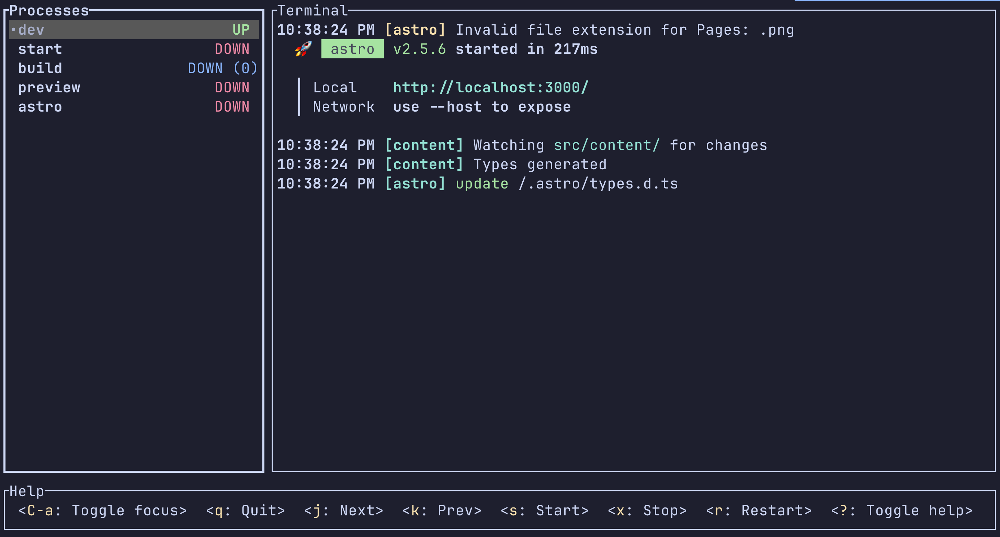

Para muchos proyectos modernos es necesario **tener varios procesos de larga duración ejecutándose al mismo tiempo**.

Por ejemplo:

```shell
npm run dev
npm run test:watch
```

o quizás:

```shell
vite
npm run test:watch
```

Tener que iniciar y supervisar cada uno de ellos en una **pestaña distinta de la terminal**, y reiniciarlos cuando fallan, puede resultar bastante molesto.

No lo suficiente como para querer configurar tmux, pero sí lo suficiente como para buscar algo más cómodo.

Aquí es donde entra una herramienta muy útil llamada **mprocs**.



---

## Qué es mprocs

**mprocs** es una herramienta CLI que permite **ejecutar múltiples comandos en paralelo dentro de una sola terminal**.

Cada proceso aparece en su propio panel y puedes navegar entre ellos fácilmente.

Además, puedes iniciar, reiniciar y detener procesos usando los keybinds integrados:

* `j` → bajar al siguiente proceso
* `k` → subir al proceso anterior
* `s` → iniciar un proceso
* `x` → detener un proceso
* `r` → reiniciar un proceso
* `q` → salir de mprocs cuando todos los procesos terminen

Si quieres agregar un proceso manualmente, puedes hacerlo presionando la tecla `a` y escribiendo el comando.


<aside class="highlight">

💡 **Nota:**
Si quieres keymaps, puedes acceder [aquí](https://github.com/pvolok/mprocs?tab=readme-ov-file#default-keymap)
</aside>

---

## Ejecutar varios comandos en paralelo

La forma más simple de usar `mprocs` es pasarle los comandos directamente.

Por ejemplo:

```bash
mprocs "npm run dev" "npm run test:watch"
```

Esto abrirá una interfaz en la terminal con **dos paneles**, uno para cada proceso.

Cada panel muestra su output en tiempo real.

<aside class="highlight">

💡 **Tip:**
Si estás en un proyecto con un `package.json`, puedes usar:

</aside>

```bash
mprocs --npm
```

Esto listará automáticamente todos los scripts disponibles en el proyecto.

---

## Usar un archivo de configuración

Si siempre ejecutas los mismos procesos, es más cómodo usar un archivo de configuración llamado `mprocs.yaml`.

Este archivo se crea normalmente en la **raíz del proyecto**.

Por ejemplo:

```yaml
procs:
  server:
    cmd: ["npm", "run", "dev"]
  build:
    shell: "npm run build:watch"
  tests: "npm run test:watch"
```

Luego simplemente ejecutas:

```shell
mprocs
```

Y se lanzarán automáticamente todos los procesos definidos.

---

## Cuándo es útil usar mprocs

`mprocs` es especialmente útil cuando trabajas con proyectos que necesitan **varios servicios ejecutándose al mismo tiempo**.

Por ejemplo:

* frontend + backend
* workers
* procesos de build
* tests en modo watch

En lugar de abrir muchas terminales, puedes ver todo desde un solo sitio.

---

## Alternativas a mprocs

Existen otras herramientas que permiten ejecutar varios procesos desde la terminal, como:

* `tmux`
* `concurrently`
* `foreman`

Sin embargo, **mprocs destaca por su interfaz simple y fácil de usar directamente desde la terminal**.

No requiere prácticamente configuración para empezar.

---

## Conclusión

Si tu proyecto necesita ejecutar varios procesos al mismo tiempo, abrir múltiples terminales suele ser la solución más común.

Pero herramientas como **mprocs** hacen esto mucho más cómodo.

Puedes arrancar todos los procesos a la vez y ver sus logs en una sola terminal.

Una vez que te acostumbras, es difícil volver a gestionar varios procesos manualmente en diferentes ventanas.

---

## FAQ

### ¿Qué es mprocs?

mprocs es una herramienta CLI que permite ejecutar múltiples comandos en paralelo y visualizar sus logs en una interfaz de terminal.

### ¿Para qué sirve ejecutar comandos en paralelo?

Permite trabajar con proyectos que requieren varios servicios simultáneamente, como servidores de desarrollo, watchers o tests automáticos.

